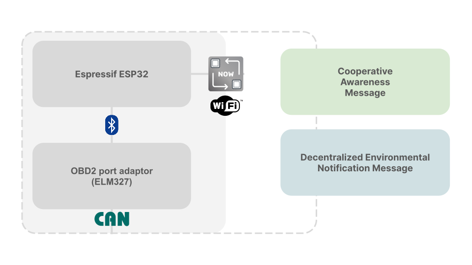

# ESP-VANET 🚒

> **_ESP32-based, VANET-like, inter-vehicular communication network to provide mock ETSI ITS-G5  message, like Cooperative Awareness Messages and Decentralized Environmental Notification Messages, to nearby cars._**

_This was proposed as the final project for the Automotive Connectivity course within my Computer Engineering master's degree._



## Abstract

It's known how far an efficient and well-established _V2V_ and _V2X_ network would lead toward better travel safety, rarer traffic congestions and lower fuel emissions.  

To achieve those goals, both the US and the EU have made proposals that could lead to standardizing the V2X/V2V communication. In particular, the European Telecommunications Standards Institute
(ETSI) has proposed a middleware solution for sharing information between nearby vehicles. These are the _Cooperative Awareness Message (**CAM**)_ and _Decentralized Environmental Notification Message (**DENM**)_.

The ESP32 is a low-cost low-power microcontroller family by Espressif very popular in the industry due to its high efficiency and versatility. Besides the WiFi and Bluetooth standard connectivity, it also offers **ESP-NOW** a wireless communication protocol between microcontrollers.  

**This project simulates the standard CAM and DENM messages, using an ESP32 mesh built over ESP-NOW; and it is aimed to leverage the constraints needed to deploy a system like this**, since a generally available MCU and the OBD2 port - which is already present in all the cars - are the only things needed for the code to work.

## Technical Details

### ESP-NOW

> ESP-NOW is a wireless communication protocol defined by Espressif, which enables the direct, quick and low-power control of smart devices, without the need of a router. ESP-NOW can work with Wi-Fi and Bluetooth LE, and supports the ESP8266, ESP32, ESP32-S and ESP32-C series of SoCs. [(Source)](https://www.espressif.com/en/solutions/low-power-solutions/esp-now)

Moreover, it is connectionless, each device can be paired with up to 20 other peers, the max length of the payload is 250 Byte and the standard bit rate is 1 Mbps. As in WiFi, each device has a unique MAC address that can be used to send messages to it. For broadcast messaging, the address is `0xff:0xff:0xff:0xff:0xff:0xff`.

The messages are sent in promiscuous mode to be able to monitor the packets. In particular, using this mode it makes possible to get the _Received Signal Strength Indicator_ (**RSSI**) for each packet, as done in [other libraries](https://github.com/gmag11/QuickESPNow/blob/main/src/QuickEspNow_esp32.cpp#L365-L357).

### CAM and DEMN

ETSI TC ITS (Intelligent Transport Systems) has defined a _Basic Set of Applications_ provided to manage two types of messages.

>Cooperative Awareness Messages (CAMs) are messages exchanged in the ITS network between ITS-Ss to create and maintain awareness of each other and to support cooperative performance of vehicles using the road network. A CAM contains status and attribute information of the originating ITS-S. The content varies depending on the type of the ITS-S. For vehicle ITS-Ss the status information includes time, position, motion state, activated systems, etc. and the attribute information includes data about the dimensions, vehicle type and role in the road traffic, etc. [(Source)](https://www.etsi.org/deliver/etsi_en/302600_302699/30263702/01.03.02_60/en_30263702v010302p.pdf)

> A DENM contains information related to a road hazard or an abnormal traffic conditions, such as its type and its position. The DEN basic service delivers the DENM as payload to the ITS networking & transport layer for the message dissemination. [(Source)](https://www.etsi.org/deliver/etsi_en/302600_302699/30263703/01.02.02_60/en_30263703v010202p.pdf)

DEMN messages indeed are sent only when some event occurs, like an accident or environmental emergency. In this project, they are only sent when a car has a certain deceleration, as when an accident occurs.  

On the other hand, CAM messages are sent with a variable frequency (1-10Hz), that is lower when the car doesn't move. There are indeed two conditions provided by the standard for the message generation trigger:

1. The time elapsed from the last is greater than a dynamic value and at least one of the following:
    - The delta heading is more than 4°,
    - The delta distance is more than 4m,
    - The delta speed is more than 0.5m/s

2. The time elapsed is greater than the provided max value.

For this project the time values are constant and only the last movement constraint is adopted, this is due to some technical constraints explained below.  

#### Flooding and broadcast suppression

Since the V2V connection was born to handle infrastructure-less environments, every packet received can be rebroadcasted once to spread the messages to further vehicles. However, to avoid the huge noise problem, the IEEE 802.11p RSS broadcast suppression approach is applied also in this project. In particular, every packet received from a vehicle is retransmitted (_up to once_) with a probability $p$ computed as below.

```math
p = 
\begin{cases}
    0, & \text{RSSI} > \text{RSS}_{max} \\
    \frac{\text{RSS}_{max}-\text{RSSI}}{\text{RSS}_{max}-\text{RSS}_{min}},& \text{RSS}_{min} \le \text{RSSI} \le \text{RSS}_{max}\\
    1, & \text{RSSI} < \text{RSS}_{min}
\end{cases}
```


### OBD-2 port adaptor

The On-Board Diagnostic is a standardized way to provide vehicles with self-diagnostic and reporting capability. It can also be used to read real-time data along with several diagnostic trouble codes. In his second standard version, it is accessible from the _data link connector_ (DLC), a 16-pin D-shaped connector places usually in the instrument panel. Two of these pins are the CAN high and the CAN low, while the others have other purposes such as a 12V battery output voltage.  

To use this port, in this project, an ELM327 chip has been used, since it can abstract the low-level protocol and present it as a simple interface that can be called via a UART or by USB, RS-232, Wi-Fi or, as in this case, via Bluetooth. The queries are managed by the [ELMduino](https://github.com/PowerBroker2/ELMduino) library.  

#### Caveats

Although the OBD-2 port could been reverse-engineered and read data such as steering angles and air-bag crashes, these change from manufacturer to manufacturer. This project uses only standard codes so that it can remain valid for every car manufacturer. This is the reason why currently only the deceleration is taken into account when DENM are generated.  

## Message Structure

The structure is used both for the DENM and the CAM, so a `type_message` enum is used to distinguish them.

```cpp
enum type_message : uint8_t{
	CAM = 0,
	DEMN = 1
};

typedef struct{
	type_message type;
	uint8_t sender_address[6]; //original sender, not change when the message is forwarded
	uint8_t coordinates[3]; //currently not used, but present in the standard
	uint8_t severity;  //from 0 to 5, used only for the DENM
	uint8_t speed; //read from the ODB port
	uint8_t debug; //boolean; when debugging, the speed is random
	uint8_t rebroadcasted; //boolean; becomes true after the first time the packet is forwarded
} message;
```